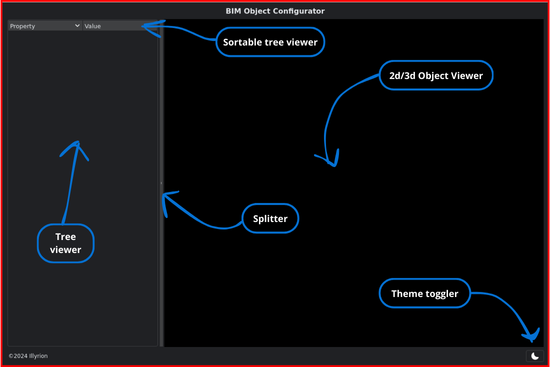

# 💡 Usage

***

## UI

<figure><figcaption>
screenshot of the UI
</figcaption></figure>

Basically the idea is to have a editor to adjust the parameters of predefined objects. those objects are designed with logical scalability in mind, which in our opinion is lacking in the industry.

***
